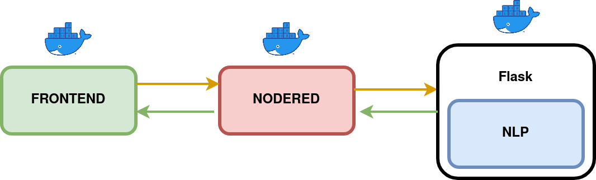

# Réalisation d'un Chatbot

**Kézako?**: 
 Les chatbots également appelés bot, chat robot ou chat simulator sont des ‘nouveaux outils’ web favorisant la conversation instantanée. Ces nouveaux programmes utilisent en fait, une intelligence artificielle (plus ou moins développée) leur permettant de discuter avec des utilisateurs et de leur proposer des services adaptés à leurs demandes directement depuis une application de messagerie instantanée (type Messenger) ou depuis un site web. 

**Objectif**: Mettre en place un chatbot de A à Z en suivant l'architecture suivante:



# Questions:

1. Ecrire le Dockerfile de l'application frontend dans le dossier frontend
2. Ecrire à la racine du projet un fichier docker-compose.yml
3. Essayez de comprendre dans les grandes lignes ce que fait le code frontend
4. Démarrez le Dockerfile qu'il y a dans le dossier de nodered, accédez à l'application.
5. Ajoutez le service nodered au docker-compose.yml, puis essayez de démarrer l'ensemble des services avec `docker-compose up`
6. Récupérez dans nodered un message envoyé depuis le frontend
7. Envoyez une réponse en retour, de nodered vers le frontend
8. Ajoutez une brique Flask, commencez par écrire un endpoint API /hello qui renvoie 'hello world'
9. Ecrivez le Dockerfile de votre application Flask
10. Ajoutez le service au fichier docker-compose.yml
11. Assemblage de briques, mettez en place le scénario suivant: 
* Frontend envoie un message à nodered
* nodered appel un endpoint Flask via une méthode POST sur /nlp
* Flask retourne le payload suivant:
```json
    {
        'message': 'hey',
        'intents': 'salutations',
        'probability':0.95
    }
``` 
Le message est récupéré par Nodered
* Nodered renvoie le message au frontend
11. Ecrivez un modèle de NLP

# Solutions
1. 
```bash
docker build -t html-server:1.0 .
docker run -d -p 80:80 html-server:1.0 
```
2. cf: docker-compose.yml (tester avec un docker-compose up)
3. Voir où sont récupérés les messages, comment ils peuvent être envoyés? La forme de l'objet?
4. Se placer dans le dossier nodered 
```bash
docker build -t nodered:1.0 .
docker run -d -p 1880:1880 nodered:1.0 
```
5. cf: docker-compose.yml (tester avec un docker-compose up)
6. Il faut que nodered expose un endpoint /chatbot et récupère le message via POST puis le frontend va envoyer un message sur cette API.
Importez le flow1 puis lancez Insomnia pour tester le webservice: 
```bash
POST: http://localhost:1880/chatbot
payload:
{
    "message": "your sentence"
} 
```
